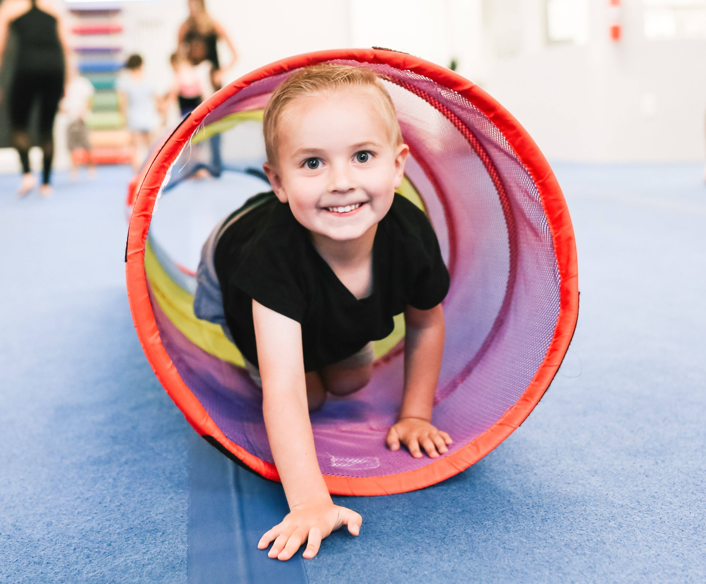

# Indoor Birthday Party, Utah Tumbling Academy

:::callout{type="info"}
We booked the Utah Tumbling Academy indoor instructor guided birthday party! Two hours of fun for the kids, and a low-stress party for mom!
:::

:::image-grid{columns=2}
/assets/blog/utah-tumbling-academy/Bubble.jpg|Kids playing with bubbles
/assets/blog/utah-tumbling-academy/Tunnel.jpg|Kids in the tunnel
/assets/blog/utah-tumbling-academy/Kids-On-Blocks.jpg|Kids on blocks
/assets/blog/utah-tumbling-academy/Kids-Seen-And-Heard.jpg|Kids having fun
:::

:::pricing
Package A|$199|Includes instructor and 2 hours of fun
Package B|$249|Includes instructor, food, and decorations
Package C|$299|All-inclusive package with special activities
:::

My little one was so excited to plan her 5th birthday party. She wanted everything fairy and Tinkerbell themed. Green with a little yellow and white. This was her first birthday party with friends, and it was fun watching her choose and create all the details, but most importantly, what they were going to do! She loves gymnastics and so when I told her the Utah Tumbling Academy lets people do birthday parties there, she was planning full speed ahead!

The Utah Tumbling Academy was great to work with. We emailed them throughout the planning, which is easier for me because phone calls with kids in the background… not so fun lol. We scheduled the party, arranged the type of party, and they answered all my birthday party questions with prompt replies, or within the next business day.

You can view their party options on this **[Utah Tumbling Academy page!](https://utahtumblingacademy.com/parties/)**.

We booked the birthday party **Package A** which included a Utah Tumbling Academy (UTA) Instructor to guide the party. I totally recommend this! The UTA instructor was so good with the kids and she kept them so busy. They went from activity to activity! They would run out to get drinks quick but then they were right back in the tumbling room playing! The laughter, smiles, and energy were nonstop!

They have a party room which has a window into the tumbling room. So, I was able to visit with the moms that decided to stay at the party, and it was quite relaxing for me too. Within the first 15 minutes the party instructor had several kids climbing on her and she just laughed and kept playing with them. Within the first 30 minutes she knew each one of them by name and would call out to them during play. That made it feel so special to not just have the kids be numbers, but to have them be seen and heard as the little people they are!

The two-hour party that we booked had a 45-minute break in the middle of the play time. This was the perfect amount of time for a little lunch, gifts, and then cake and ice cream. Utah Tumbling Academy Salt Lake location has a fridge/freezer, sink and microwave, but the Draper location does not.

My older daughter has already said that she wants to have her party here this fall, and I am totally on board! What do you want to know about hosting a birthday party at the Utah Tumbling Academy? We are happy to answer all your questions by sharing our experience!

